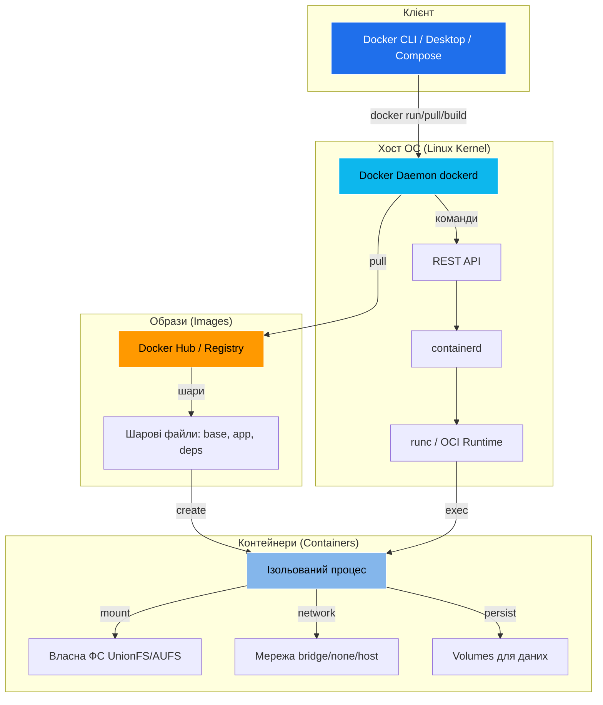
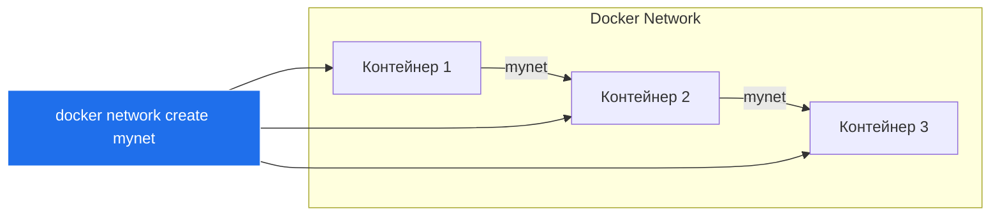
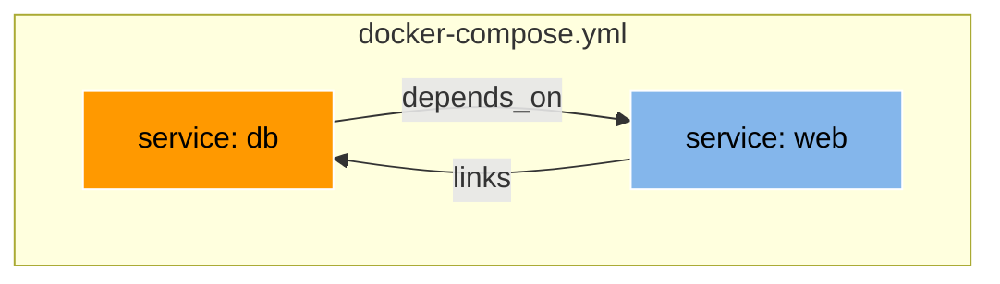

# 📋 ЛАБОРАТОРНА РОБОТА №10

## 📌 Дисципліна: "Хмарні технології та сервіси"

## 🏷 Тема:
> Знайомство з Docker: робота з контейнерами, Apache та Nginx

## 👨‍🎓 Виконав:
- Нагорний І.М. РПЗ-24Б

---

## 🎯 Мета роботи
1. Ознайомитися з інструментами контейнеризації Docker.
2. Встановити Docker, завантажити образи, запускати контейнери.
3. Встановити та налаштувати вебсервери Apache/Nginx у контейнерах.
4. Дослідити керування контейнерами (запуск, зупинка, видалення).
5. Порівняти роботу з різними дистрибутивами Linux.

## 🛠 Матеріальне забезпечення
- 💻 ОС: Windows 10 (або Linux/Mac).
- 🌐 Docker Desktop (встановлено з офіційного сайту).
- 🔧 Термінал: PowerShell / CMD / Terminal.
- 🌍 Браузер: Chrome для перевірки http://localhost.

---

## 📚 Попередня підготовка: Відповіді на питання
### 1. Діаграма архітектури Docker

**Пояснення**: Клієнт надсилає команди Daemon'у, який керує контейнерами через containerd (runtime). Образи – шарові шаблони, контейнери – запущені екземпляри.

### 2. Відмінність Docker-контейнер від Docker-образу
- **Образ (Image)**: Статичний шаблон (шаровий файл), як "сніпшот" файлової системи + залежності. Не запускається.
- **Контейнер**: Запущений процес на основі образу. Має власну ФС, мережу, PID. Зміни в контейнері не зберігаються після видалення (якщо не commit).

### 3. Список запущених контейнерів
```bash
docker ps # тільки запущені
docker ps -a # всі (включно зупинені)
```

### 4. Передача локального порту до контейнера
Використовуй `-p host_port:container_port` у `docker run`:
```bash
docker run -p 8080:80 nginx # localhost:8080 --> контейнер:80
```

### 5. Зв'язок кількох контейнерів

- **Docker Network**: Створи мережу `docker network create mynet`, додай контейнери `--network mynet`.
- **Docker Compose** (файл `docker-compose.yml`):

- **Linking** (старе): `--link`, але deprecated – краще networks.

---

## 📋 Хід роботи
### 1. Встановлення Docker та перевірка статусу
- Завантажив Docker Desktop з [docker.com](https://www.docker.com/products/docker-desktop).
- Встановив, запустив.
- Перевірка:
```bash
docker --version # Docker version 27.3.1
docker run hello-world # Тестовий контейнер
```


**Пояснення**: Docker Desktop включає Engine, CLI, Compose. Статус – активний у tray.

### 2. Завантаження образу Ubuntu
```bash
docker pull ubuntu:latest
```


**Пояснення**: Образ ~70 MB, шаровий (base layers).

### 3. Запуск контейнера з оболонкою
```bash
docker run -it --name my-ubuntu-apache ubuntu /bin/bash
```


**Пояснення**: `-it` – інтерактивний термінал, `--name` – ім'я.

### 4. Встановлення Apache у контейнері
Усередині контейнера:
```bash
apt update && apt install -y apache2
```
**Пояснення**: Apache2 – стандартний пакет Ubuntu.

### 5. Налаштування та запуск Apache
- Конфіг: `/etc/apache2/apache2.conf`, `/etc/apache2/sites-enabled/000-default.conf`.
- Додав у `/var/www/html/index.html`:
```html
<!DOCTYPE html>
<html><body><h1>Apache in Docker!</h1><p>Team: Нагорний Ілля, РПЗ-24Б</p></body></html>
```
- Запуск:
```bash
service apache2 start # або /usr/sbin/apache2ctl -D FOREGROUND
```


**Пояснення**: Для foreground – щоб контейнер не виходив.
> **Примітка**: Для доступу ззовні – перезапусти контейнер з `-p 8080:80` (див. п.8).
### 6. Вихід з контейнера (без зупинки)
```bash
exit # або Ctrl+P, Ctrl+Q (detach)
```


**Пояснення**: Контейнер продовжує працювати в background (якщо сервер запущений).

### 7. Перевірка запущених контейнерів
```bash
docker ps -a
```


**Пояснення**: `-a` показує stopped/exited.

### 8. Перевірка в браузері
- Перезапусти контейнер з портом (якщо не зроблено):
```bash
docker stop my-ubuntu-apache
docker rm my-ubuntu-apache
docker run -d -p 8080:80 --name my-ubuntu-apache ubuntu /usr/sbin/apache2ctl -D FOREGROUND
```
- Відкрий http://localhost:8080


**Пояснення**: `-d` – detached mode.

### 9. Додавання ПІБ у конфігурацію Apache
- У контейнері (attach: `docker exec -it my-ubuntu-apache /bin/bash`):
- Редагуй `/etc/apache2/sites-enabled/000-default.conf`:
```apache
<VirtualHost *:80>
    DocumentRoot /var/www/html
    ErrorLog ${APACHE_LOG_DIR}/error.log
    CustomLog ${APACHE_LOG_DIR}/access.log combined
    # Додано:
    ServerSignature On
    ServerTokens Full
</VirtualHost>
```
- У `index.html` додав ПІБ (як у п.5).
- Перезапуск: `apache2ctl restart`


**Пояснення**: ServerSignature показує в footer: "Apache/2.4.XX Server at localhost Port 80" + custom HTML.
  
### 10. Зупинка контейнера
```bash
docker stop my-ubuntu-apache
```
### 11. Видалення контейнера
```bash
docker rm my-ubuntu-apache
```
### 12. Повторення з Debian + Nginx
- Pull:
```bash
docker pull debian:latest
```
- Run + install:
```bash
docker run -it --name my-debian-nginx debian /bin/bash
apt update && apt install -y nginx
```
- HTML: `/var/www/html/index.nginx-debian.html` з ПІБ.
- Run detached:
```bash
docker run -d -p 8081:80 --name my-debian-nginx debian /usr/sbin/nginx -g 'daemon off;'
```
- Браузер: http://localhost:8081
- Stop/rm: аналогічно.
**Пояснення**: Nginx легший, config у `/etc/nginx/sites-enabled/default`.
  
---

## ❓ Контрольні питання
1. **Відмінність docker stop і docker rm?**  
   `docker stop` – gracefully зупиняє контейнер (SIGTERM, зберігає стан). `docker rm` – видаляє контейнер (всі дані втрачаються, якщо не volume).
2. **Альтернативи Docker? Порівняння**  
   ```mermaid
   graph LR
       D[Docker] -->|Daemon-based| P1[Podman: Rootless, daemonless]
       D -->|High-level CLI| P2[containerd: Low-level, Kubernetes]
       D -->|Lightweight| P3[LXC/LXD: OS-level, ближче до VM]
       style D fill:#0db7ed,stroke:#fff,color:#000
       style P1 fill:#ff9900,stroke:#fff,color:#000
   ```
   | Альтернатива | Можливості | Порівняння з Docker |
   |--------------|------------|---------------------|
   | **Podman** | Rootless, daemonless, сумісний з Docker CLI | Безпечніше (без root), але менше enterprise-фіч. |
   | **containerd** | Low-level runtime | Базовий, без CLI – для Kubernetes. |
   | **LXC/LXD** | OS-level virtualization | Ближче до VM, важче, повна ізоляція. |
   | **rkt (CoreOS)** | Deprecated | Фокус на безпеку, але не популярний. |
3. **Rootless-контейнеризація?**  
   Запуск контейнерів без root-привілеїв (user namespaces). Приклади: Podman rootless, Docker `--user`, rootless Docker daemon. Ізолює від хоста.
4. **Вплив rootless на безпеку?**  
   ```mermaid
   graph TD
       R[Rootless] -->|+| S1[Зменшує attack surface]
       R -->|+| S2[Запобігає escalation]
       R -->|-| L1[Обмеження портів <1024]
       style R fill:#84b6eb,stroke:#fff,color:#000
   ```
   + Зменшує attack surface (немає root на хості).  
   + Запобігає privilege escalation.  
   – Обмежений доступ до ресурсів (ports <1024, devices).
5. **Роль контейнеризації в хмарних технологіях?**  
   ```mermaid
   graph TD
       C[Контейнеризація] --> K[Kubernetes/EKS]
       C --> CI[CI/CD: Jenkins in Docker]
       C --> M[Microservices]
       C --> P[Портативність: GCP/AWS]
       style C fill:#1f6feb,stroke:#fff,color:#fff
   ```
   Портативність, масштабування (Kubernetes/EKS), CI/CD (Jenkins in containers), microservices, гібридні/мультихмари. Знижує "works on my machine".

---

## 📝 Висновки
Лабораторна робота №10 дозволила практично ознайомитися з Docker: встановлення, pull/run контейнерів, налаштування Apache/Nginx, порти, керування. Виконано з Ubuntu та Debian. Освоєно ізоляцію, шарові образи, foreground/daemless режими. Робота підготувала до контейнеризації в хмарах (GCP, AWS ECS).

---

## 🔗 Корисні посилання
- [Docker Docs](https://docs.docker.com)
- [Docker Hub](https://hub.docker.com)
- [Play with Docker](https://labs.play-with-docker.com)
- [Docker Crash Course](https://youtu.be/example)
- [Docker - що таке докер?](https://youtu.be/ntNmPkoF_CU?si=ODG4gDd0hsttcqPP)
- [Що таке docker? Контейнери та образи](https://youtu.be/3R3QMbIeJb8?si=zsxUI9qhm_ZAMaeS)
- [Docker: Cтворення Image з Dockerfile. Робота з DockerHub. Cтарт і Cтоп DOCKER Контейнерів](https://youtu.be/C5QjvhFN6PE?si=1ul-5r7w0Sm-rV8E)
- [Як почати працювати з Docker за 25 хвилин!](https://youtu.be/SCX4atruMTs?si=HnBZp6HNtwoUHHIN)
- [Docker Crash Course for Absolute Beginners](https://youtu.be/pg19Z8LL06w?si=vIBT4Gy-Ka11tK6C)
- [Ultimate Docker Compose Tutorial](https://youtu.be/SXwC9fSwct8?si=VcqcrEVEwvtSjIMB)

## 🎯 Система оцінювання
- 📚 Питання попередньої підготовки: 10 балів
- 📋 Практичні завдання (п.1-11): 10 балів
- 📋 Практичні завдання (п.12): 10 балів
- ❓ Контрольні питання та висновки: 10 балів
- 🌐 Використання англійської мови (фрагментарно): +5 балів  
**Total: 45/45**